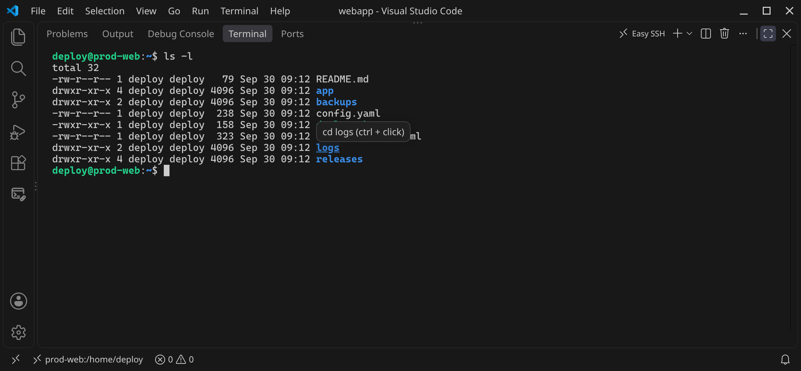

# Easy SSH

[](https://github.com/sponsors/dhlptx00)
[](https://buymeacoffee.com/dhlptx00)


A terminal for SSH connections inside VS Code and Cursor.

Easy SSH talks SSH directly from your computer. It does not install anything on the server, and it does not download a remote editor when you connect. The same terminal works on an internal network and on the public internet.


*Quick demo: connect, click a directory to `cd` into it, click a file to download it.*

## What you can do

- Save, edit, and delete SSH connections
- Sign in with a password, a private key, or an SSH agent
- Hop through one or more jump hosts
- Import hosts from `~/.ssh/config`
- Open a remote Linux shell in your home directory
- Run commands, full-screen programs, and `sudo` the same way you would over `ssh`
- Click a file name to download it to your Desktop
- Drag a file or folder onto the terminal to upload it into the current directory
- Open another session from the activity-bar icon or **Easy SSH: New Terminal**

## Open it

Click the **Easy SSH** icon in the activity bar. Each click opens another terminal tab with its own connection list. Close that tab, or type `/quit` in it, to dismiss it.


*The connection list. Up and Down select a connection, Enter connects.*

## Commands

On the connection panel, type `/` to open the command list. Connections and system commands are listed in separate groups. Up and Down move through the list, further typing filters it, and Enter runs the highlighted row. With the list closed, Up and Down move the connection selection.

| Command | Action |
| --- | --- |
| /name | Connect to the saved connection with that name |
| /new | New connection |
| /edit | Choose a connection, then edit it |
| /delete | Choose a connection, then delete it |
| /import | Import `~/.ssh/config` |
| /folder | Choose the local download folder |
| /quit | Close the terminal |
| Enter | Connect to the selected connection |


*Type `/` to open the command list.*

### New, edit, and delete

| `/new` | `/edit` | `/delete` |
| --- | --- | --- |
|  |  |  |
| Fill in the fields for a new connection | Change a connection, here adding a jump host | Confirm before a connection is removed |

### Remote shell

A connection opens your login shell in the home directory, the same kind of shell `ssh` starts. The terminal is passed through: what you type goes to the server, and what the server prints is shown as-is. Aliases such as `ll`, functions, and the current directory stay in effect. `vim`, `less`, `top`, and `sudo` work as they do in a normal terminal. The password you type for `sudo` is not echoed. `clear` and `reset` clear the screen. Resizing the panel updates both the width and the height, so `stty size` follows the window.


*A remote login shell, the same as over `ssh`.*

Click a file name to download it to the Desktop. Click a directory name to `cd` into it. Drag a file or folder onto the terminal to upload it into the current directory. Progress for those transfers is shown in the status bar. `exit` closes the shell and returns to the connection list.



*Click a directory name to `cd` into it.*

Each click of the activity-bar icon opens another terminal, and so does **Easy SSH: New Terminal**. Each one connects on its own. The first terminal is named Easy SSH, and the next are Easy SSH 2, Easy SSH 3, and so on.

Hold Option on macOS, or Shift on Windows and Linux, and drag to select text.

| Action | Result |
| --- | --- |
| Type, arrows, Tab, Ctrl+R, Ctrl+L | The remote shell handles the keys. Tab finishes a path such as `cd /tm` |
| Click a file name | Download it to the Desktop |
| Click a directory name | `cd` into it |
| Drag a file or folder here | Upload it into the current directory |
| Ctrl+C | Stop the running command |
| Ctrl+Z | Suspend the running command (`fg` continues it) |
| Paste | Keep line breaks, including a heredoc |
| `exit` | Disconnect |

Passwords and key passphrases are hidden while you type. Press Enter on a saved secret to keep it. Authentication and the jump host are choices: move with Up and Down, then press Enter. A custom jump host is the only extra text. Type `user@host:port`. Separate extra hops with commas.

## Downloads and uploads

Downloaded files go to your Desktop. Type `/folder` on the connection panel, or run **Easy SSH: Set Download Folder**, to choose another folder. If the file name already exists, Easy SSH adds a number, such as `notes (1).txt`.


*Click a file name to download it. The status bar shows where it was saved.*

To upload, drag a file or a folder from your desktop onto the Easy SSH terminal. It is written into the current Linux directory. A folder is uploaded with its contents. Symbolic links inside a folder are skipped. A single drop is limited to 5000 files.

| Drag onto the terminal | Upload finished |
| --- | --- |
|  |  |

## Internal and external networks

A connection is a normal SSH session from the editor to the host you enter. Use a hostname, an IP address, or a jump host when the server is only reachable through a bastion. Jump hosts entered in the terminal use the same password, key, or agent as the connection.


*A session on `staging-db`, reached through `bastion.example.com`.*

Hosts imported from `~/.ssh/config` keep their user, port, identity file, and `ProxyJump` chain. `Host *` wildcard blocks are skipped. `Include` files under `~/.ssh` are read.


*`/import` reads the hosts from `~/.ssh/config`, including the `ProxyJump` chain. `Host *` is skipped.*

The first time you connect, the server's host key is saved. If that key changes later, the terminal asks before trusting the new one. **Easy SSH: Reset Trusted Host Keys** forgets the saved keys.

Passwords and passphrases are stored in the editor's secret storage. Private keys stay in the files you point at.

## Develop

```bash
npm install
npm test
npm run compile
```

Press F5 in VS Code or Cursor. Both hosts use the same extension API, so there is no separate Cursor build.

## Compared with SSH FS

SSH FS mounts a remote system as a workspace folder and also provides tasks and remote shells. Easy SSH is the connection list and a login shell: type commands the way you would over `ssh`, click a file name to download it, and drop a file or folder to upload it.

## Support

If Easy SSH saves you time, you can support its development:

- [GitHub Sponsors](https://github.com/sponsors/dhlptx00)
- [Buy Me a Coffee](https://buymeacoffee.com/dhlptx00)
