# Easy SSH – SSH Client & SFTP Drag-and-Drop

[](https://marketplace.visualstudio.com/items?itemName=easy-ssh.easy-ssh)
[](https://open-vsx.org/extension/easy-ssh/easy-ssh)
[](https://github.com/dhlptx00/EasySSH/actions/workflows/ci.yml)
[](LICENSE)

An SSH client in a VS Code or Cursor terminal tab. Save your hosts, hop through jump hosts, import `~/.ssh/config`, Ctrl+click a file or folder name to download, open, rename or delete it, and drag files onto the terminal to upload them.

Easy SSH talks SSH directly from your editor. **Nothing is installed on the server**, and no remote editor server is downloaded, so it works on old, small, and locked-down machines where Remote-SSH can't run.


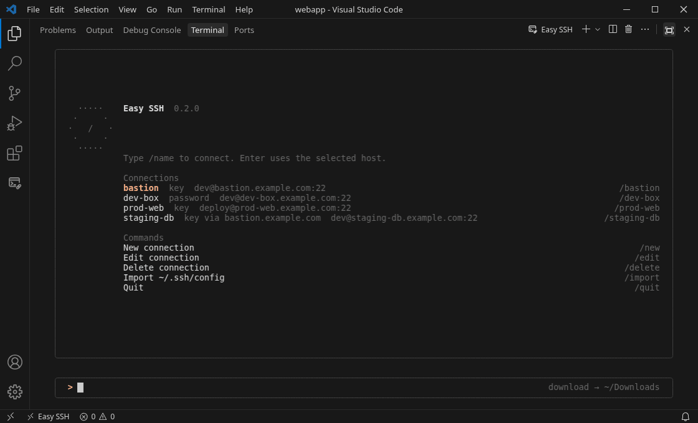

*Quick demo: connect, Ctrl+click a folder and download it, then Ctrl+click a file, open it in an editor tab and save it back with Ctrl+S. On macOS, use Cmd+click and Cmd+S.*

## Install

- **VS Code:** open the Extensions view, search for **Easy SSH**, or run `ext install easy-ssh.easy-ssh` in Quick Open (Ctrl+P / Cmd+P).
- **Cursor, VSCodium and other Open VSX editors:** search for **Easy SSH** in the Extensions view ([Open VSX page](https://open-vsx.org/extension/easy-ssh/easy-ssh)).
- **Offline:** download the `.vsix` from [GitHub Releases](https://github.com/dhlptx00/EasySSH/releases), then run **Extensions: Install from VSIX…**.

## What you can do

- Pick a connection from a **home screen** that shows your most recent connection, a table with sign-in method and last use, and the details of the selected host
- Add connections with a **guided `/new` setup**: one field per step with checks, the matching `ssh` command, and **Test connection** before you save. `/edit` changes one field at a time, `/delete` asks first
- Sign in with a password (saved, or asked every time), a private key, an SSH agent or Pageant. Two-factor prompts are shown in the terminal
- Hop through one or more jump hosts
- Import hosts from `~/.ssh/config`, including `Host *` defaults and `ProxyJump` chains
- Open your remote login shell (bash, zsh, fish and others) and use it exactly as over `ssh`, including `vim`, `top` and `sudo`
- **Ctrl+click a file or folder name** (Cmd+click on macOS) for its action menu. Files: **Download**, **Open**, **Rename**, **Delete**. Folders: **Download**, **Upload**, **Rename**, **Delete**
- **Open a remote text file in a VS Code editor tab** and save it back to the server with Ctrl+S (Cmd+S). Permissions are kept, and saving warns you if the file changed on the server in the meantime
- **Download a folder** with everything in it, the same way
- **Upload:** drag files or folders onto the terminal, as before. They go into the current remote folder
- Names you create with commands (`touch`, `mv`, `tar`, …) can be clicked right away, without a `cd`
- Follow big transfers in a progress notification with **Cancel**
- Reconnect after a dropped connection, back into the same folder
- Open several sessions, each in its own terminal tab named after the server
- Colors that **follow your VS Code theme**: Easy SSH Dark on dark themes, Easy SSH Light on light ones, switching as soon as you change the theme

## Requirements and limitations

- **Your side:** VS Code 1.85 or newer, or Cursor, on Windows, macOS or Linux.
- **Server:** a Linux or Unix server with OpenSSH or a compatible SSH server. Windows servers aren't supported.
- **Downloads and uploads need SFTP.** On a server without SFTP you still get the terminal, but no file transfers.
- **Folder tracking needs bash, zsh or fish.** In these shells the terminal follows `cd`, so clicks and drops use the right folder. Other shells work, but names aren't linked until Easy SSH knows the folder.
- After `sudo su`, `su` or a nested `ssh`, Easy SSH follows the `cd` commands it can see. Transfers still run as the user you signed in as.
- `ProxyCommand` isn't supported. Imported hosts that need it are listed and skipped; use `ProxyJump` instead.
- A single upload or folder download is limited to 5000 files (`easySsh.maxTransferFiles`).

## Open it

Click the **Easy SSH** icon in the activity bar, or run **Easy SSH: New Terminal**. Each opens another terminal tab with its own connection list. Each terminal connects on its own: the first is named Easy SSH, the next Easy SSH 2, Easy SSH 3, and so on. Close the tab, or type `/quit` in it, to dismiss it.

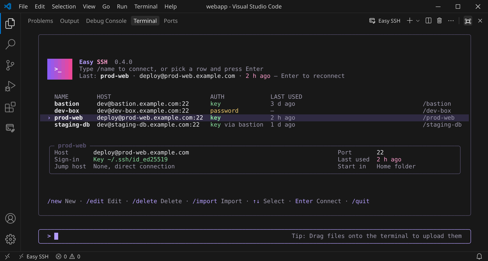

*The connection list. Up and Down select a connection, Enter connects.*

The list shows each connection's user@host:port, sign-in method (key, password, agent, and the jump host it goes through) and when you last used it. The **Last:** line under the Easy SSH mark names the connection you used most recently; the list starts on it, so Enter reconnects. When there is room, the selected connection's details (host, port, sign-in, jump host, last used, start folder) show under the list. The key hints sit at the bottom, and the prompt shows a different tip each time. With no connections yet, a **Getting started** box points to `/new` and `/import`.

## Commands

On the connection panel, type `/` to open the command list. Connections and system commands are listed in separate groups. Up and Down move through the list, further typing filters it, and Enter runs the highlighted row.

| Command | Action |
| --- | --- |
| /name | Connect to the saved connection with that name |
| /new | New connection |
| /edit | Choose a connection, then edit it |
| /delete | Choose a connection, then delete it |
| /import | Import `~/.ssh/config` |
| /folder | Choose the local download folder |
| /quit | Close the terminal |
| Enter | Connect to the selected connection |

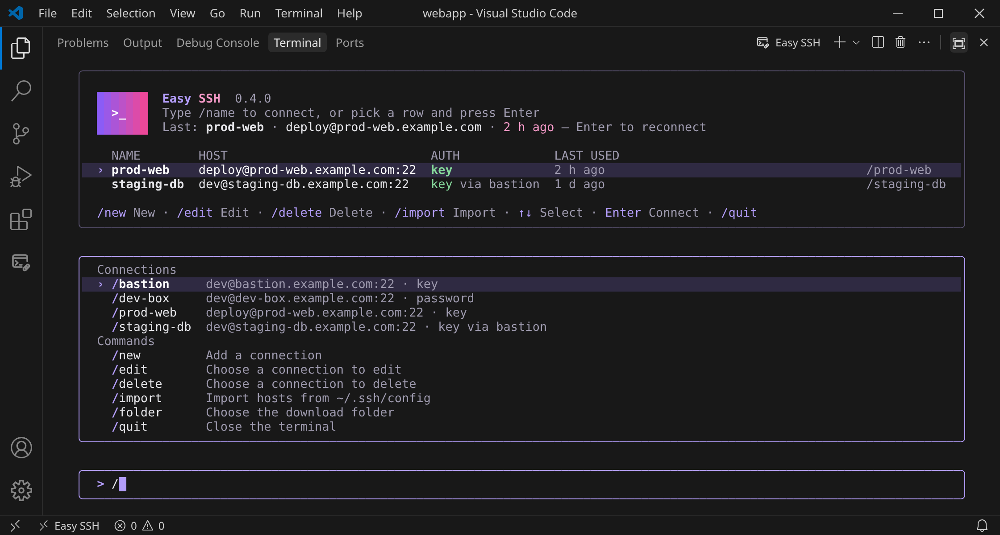

*Type `/` to open the command list.*

### New, edit, and delete

| `/new` | `/edit` | `/delete` |
| --- | --- | --- |
| 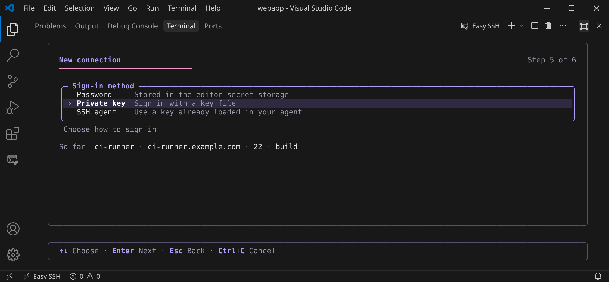 | 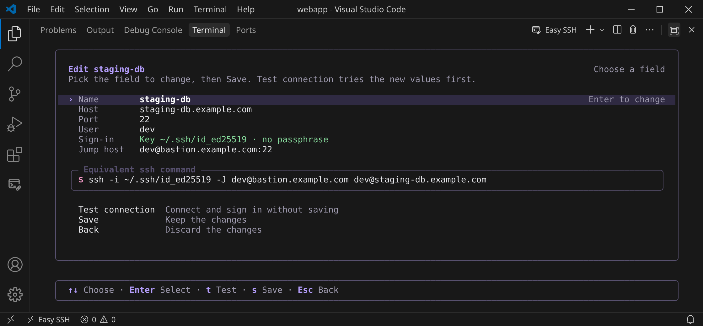 | 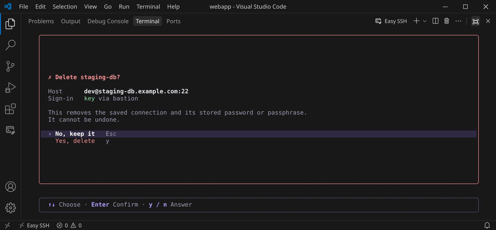 |
| One field per step, with help and checks | Pick a field, change it, save | Confirm before a connection is removed |

`/new` asks one field per step (Step 2 of 6, …), with a short help line under each field and a red message when a value can't work: an empty host, a port that isn't a number from 1 to 65535, a key file that doesn't exist. Esc goes back one step. The last page shows every value and the matching `ssh` command; from there, **Test connection** connects and signs in without saving, **Save** adds the connection, and **Back** returns to the last step. Enter on a value changes just that field.

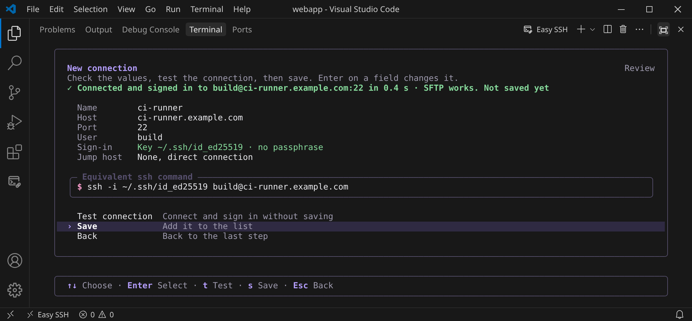

*The last page of `/new`: the values, the matching `ssh` command, and Test connection.*

`/edit` opens the same page for a saved connection: pick the field to change, then Save. `/delete` asks in red, with the connection's name and host, before anything is removed.

Passwords and key passphrases are hidden while you type and never shown afterwards. Press Enter on a saved secret to keep it. Sign-in method and jump host are choices: move with Up and Down, then press Enter. For a custom jump host, type `user@host:port`, and separate extra hops with commas.

For password sign-in you choose whether Easy SSH saves the password or asks for it at every connect. If you change a connection's sign-in method or key, jump hosts that signed in the same way change with it.

### Themes

The Easy SSH screens follow your VS Code theme: **Easy SSH Dark** with a dark theme, **Easy SSH Light** with a light one (high-contrast themes get the palette of their brightness). Change the VS Code theme and open Easy SSH terminals switch at once; there is nothing to set. Both palettes sit on VS Code's own terminal background and use the icon's purple and pink only for the brand mark, accents and a soft tint on the selected row.

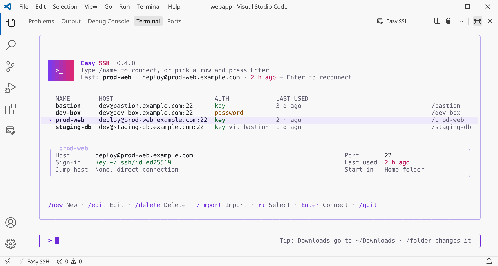

*Easy SSH Light, with VS Code's Light Modern theme.*

Connected shells get the palette's cursor and ANSI colors too, in Easy SSH terminals only, and the terminal's own colors come back when the session ends; turn that off with `easySsh.themeSession`. `easySsh.colorDepth` switches to 256 or 16 colors if colors look wrong.

## Remote shell

A connection opens your login shell in the home folder (or in the connection's start folder), the same kind of shell `ssh` starts. The login message and "Last login" line are shown as usual. What you type goes to the server, and what the server prints is shown as-is. Aliases, functions and the current folder stay in effect. `vim`, `less`, `top` and `sudo` work as in any terminal, and resizing the panel updates the window size on the server.

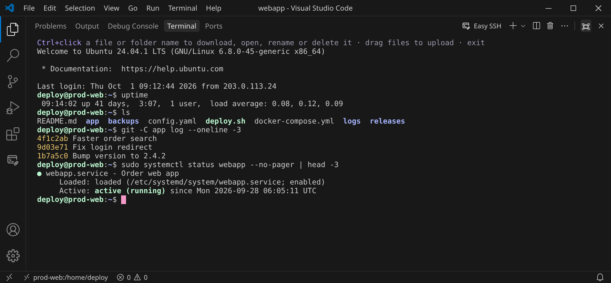

*A remote login shell, the same as over `ssh`.*

### Ctrl+click a name: the action menu

Ctrl+click a file or folder name in the remote shell (Cmd+click on macOS) to open a menu of what you can do with it. Its title shows the name and the folder it's in, for example `access.log — /home/deploy/logs`, and its placeholder the size or the number of items. **Download** is first, so Enter downloads.

| A folder | A text file |
| --- | --- |
| 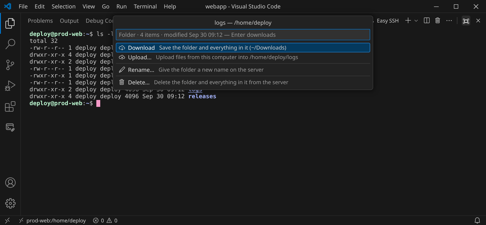 | 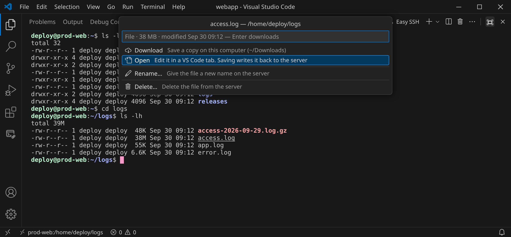 |
| Download, Upload, Rename, Delete | Download, Open, Rename, Delete |

| Action | Files | Folders | What it does |
| --- | --- | --- | --- |
| Download | ✓ | ✓ | Opens a save dialog (for a folder: a folder picker), starting in your download folder, then downloads with a progress notification and **Cancel** |
| Upload… | | ✓ | Opens a file picker titled with the target, e.g. `Upload to /home/demo/project/logs`, and uploads into the clicked folder with a progress notification. Existing names ask first. To upload into the current folder, drop files on the terminal as before |
| Open | text | | Opens the file in a VS Code editor tab. **Ctrl+S** (Cmd+S) saves it straight back to the server, keeping its permissions. Files over 5 MB ask first: **Open Anyway**, **Download** or Cancel |
| Rename… | ✓ | ✓ | Asks for the new name (the part before the extension is selected), checks it isn't taken, asks once more, then renames over SFTP |
| Delete… | ✓ | ✓ | Asks first. For a folder the question counts its files, e.g. `Delete folder "logs" and its 128 files?` (`5000+ files` for very big ones). A folder is deleted with everything in it |

**Open** is offered for text files only, so the menu for an archive, image or program is Download, Rename, Delete:

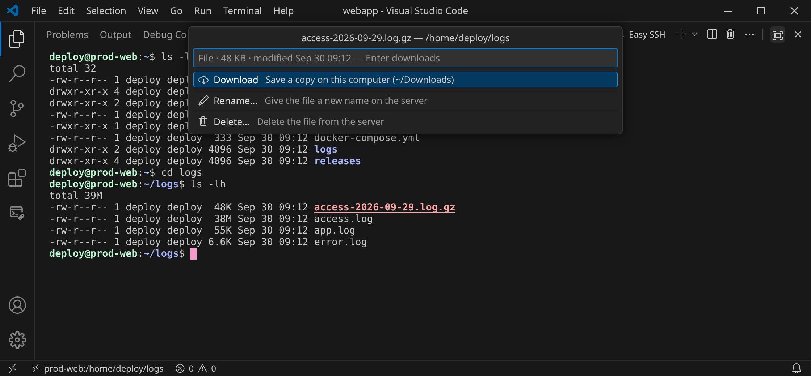

Easy SSH decides by the name first (`.txt`, `.json`, `.yaml`, `.log`, `.conf`, `.sh`, `.py`, `Dockerfile`, `.bashrc`, `authorized_keys` and many more are text; `.zip`, `.tar.gz`, `.png`, `.pdf`, `.so`, `.exe` and the like are not). For any other name it reads the first 8 KB over SFTP: no NUL bytes and valid UTF-8 means text. If that read fails or takes too long, Open is offered.

For a symbolic link, Rename and Delete change the link itself, not what it points to.

Cancelling a dialog does nothing. Every rename and delete runs over SFTP as the user you signed in as.

### Open and edit a remote file

Ctrl+click a text file name and choose **Open**. The file opens in a normal VS Code editor tab, with syntax highlighting, search and everything else the editor has. Press **Ctrl+S** (Cmd+S on macOS) to save it straight back to the server.

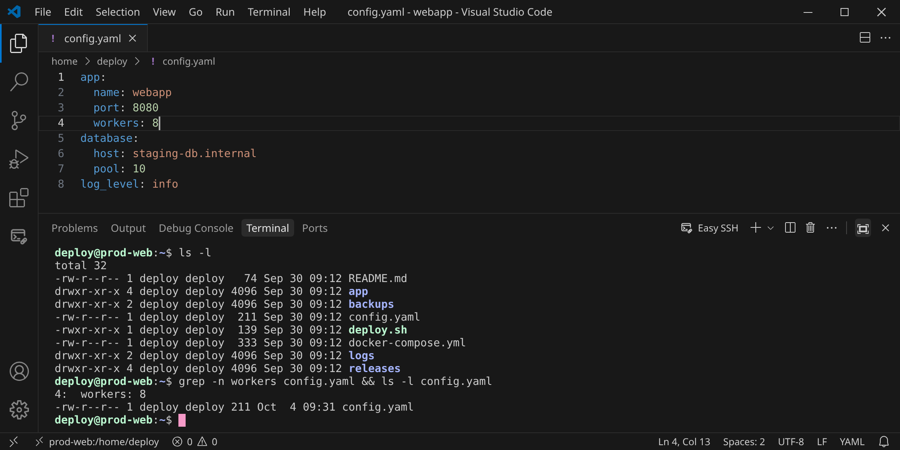

*`config.yaml` opened from the action menu, changed and saved; `grep` in the shell shows the new value.*

- The tab's address is `easyssh://<connection>/<full path>`. It reads and saves through the terminal's own connection, as the user you signed in as. Nothing is installed on the server.
- A save writes a temporary file next to the original with the same permissions, then puts it in place. A symbolic link stays a link, and a file owned by another user (or in a folder you can't write to) is rewritten in place so its owner doesn't change.
- **Big files ask first.** A text file over 5 MB shows its size and asks: **Open Anyway**, **Download** or Cancel. Files over 256 MB aren't opened in the editor; download them instead.
- **Changed on the server?** If someone else (or a command in your shell) changed the file after you opened it, saving shows both versions' size and time and asks before overwriting. Cancel keeps your edits in the editor.
- **Disconnected?** While the terminal is disconnected or closed, saving fails with a message that says so, and your changes stay in the editor. Reconnect and save again. A tab still open after VS Code reloads works again once you open a terminal for the same connection.

| Over 5 MB | Changed on the server |
| --- | --- |
| 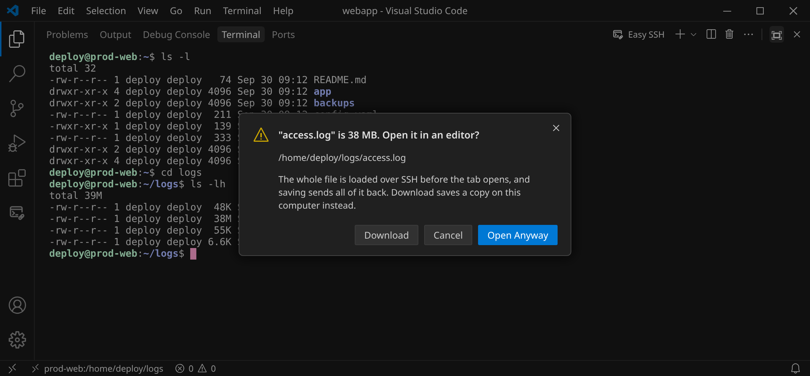 | 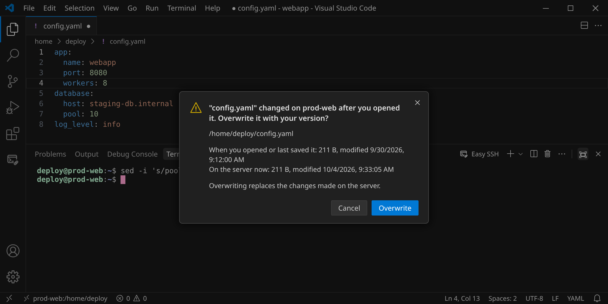 |

### Download a folder

Ctrl+click a folder name (Cmd+click on macOS) and choose **Download** to download the whole folder, including subfolders. Pick the folder it goes into; your download folder is preselected.

- The folder keeps its structure and permission bits.
- If a folder with that name already exists locally, the download is named `logs (1)`.
- Symbolic links and special files are skipped. Easy SSH lists them when the download finishes.
- The download is written into a hidden temporary folder and renamed when it's complete. A cancelled or failed download leaves nothing behind.

Big downloads and uploads, any folder, and every transfer from the action menu that takes longer than a moment show a notification with the size, speed, time left, file count and a **Cancel** button. If you start another transfer in the same terminal, it waits in a queue.

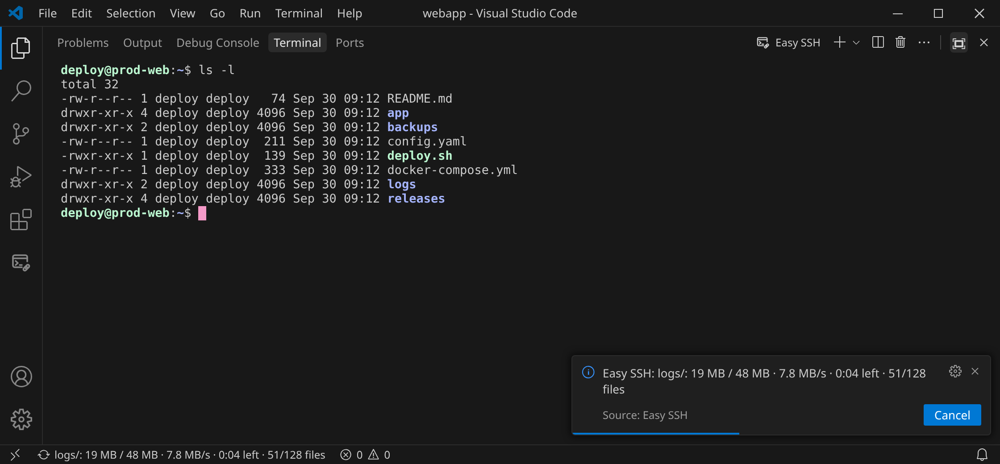

### Download a file

Ctrl+click a file name (Cmd+click on macOS) and choose **Download**. The save dialog starts in your download folder with the file's name; if you pick an existing file, the dialog asks before replacing it. When the download finishes, a message says where it was saved.

### Upload

Drag files or folders from your computer onto the Easy SSH terminal, as before. They're written into the current remote folder of the terminal you drop them on. In a split view, a drop goes to the pane under the mouse. You can also Ctrl+click a folder name and choose **Upload…** to pick files (on macOS, files or folders) to put into that folder.

- A folder is uploaded with its contents, keeping its permission bits. Symbolic links inside it are skipped.
- If something with the same name already exists, Easy SSH asks first: **Replace**, **Keep Both** (uploads as `name (1)`), or **Skip**.
- Each file is written to a hidden temporary name, then renamed into place.

| Drag onto the terminal | Upload finished |
| --- | --- |
| 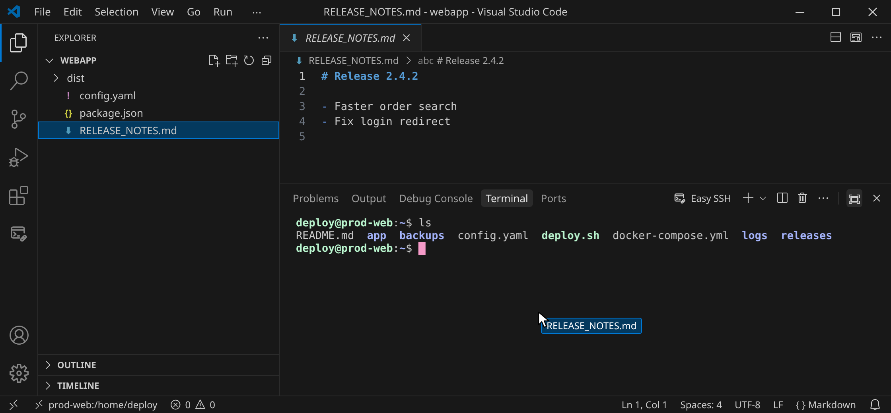 | 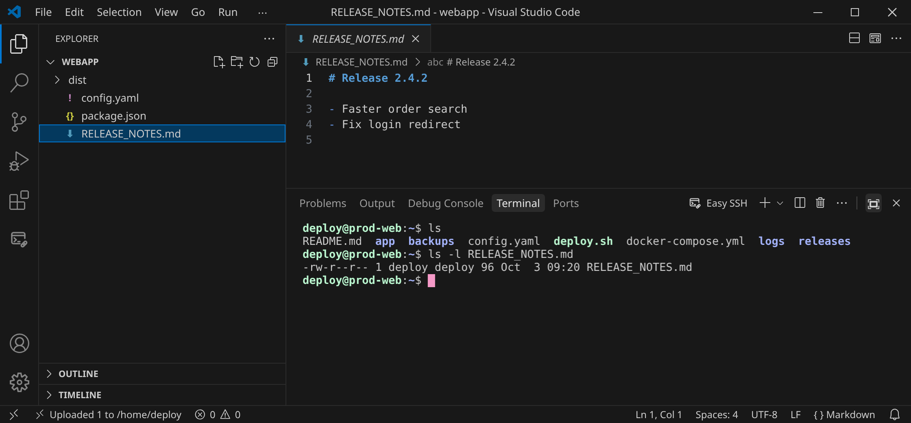 |

A path you **paste** is typed, never uploaded, when it matches what's on your clipboard. Inside full-screen programs such as `vim`, a dropped path is always typed. A drop from outside your home folder asks before it uploads.

### Names stay current

Every name the remote folder holds is a link, also right after a command creates or renames it: after each command the terminal lists the folder again (once, shortly after the prompt returns; very big folders only when they changed). So `touch notes.md`, `mv a b` or `tar xf release.tgz` give you clickable names without a `cd`.

VS Code can keep a link under a pointer that hasn't moved while the text below it changes, for example after `clear && ls`. Easy SSH checks the row when you click: if a different name is there now, the menu is for that name; if it can't tell, it asks you to move the pointer off the name and click again.

### When the connection drops

Easy SSH sends a keepalive every 15 seconds. If the server stops answering, or the network goes away, the terminal says so and offers **Reconnect**, which signs in again and opens the shell in the same folder. Turn on `easySsh.autoReconnect` to retry by itself after 2, 5 and 10 seconds.

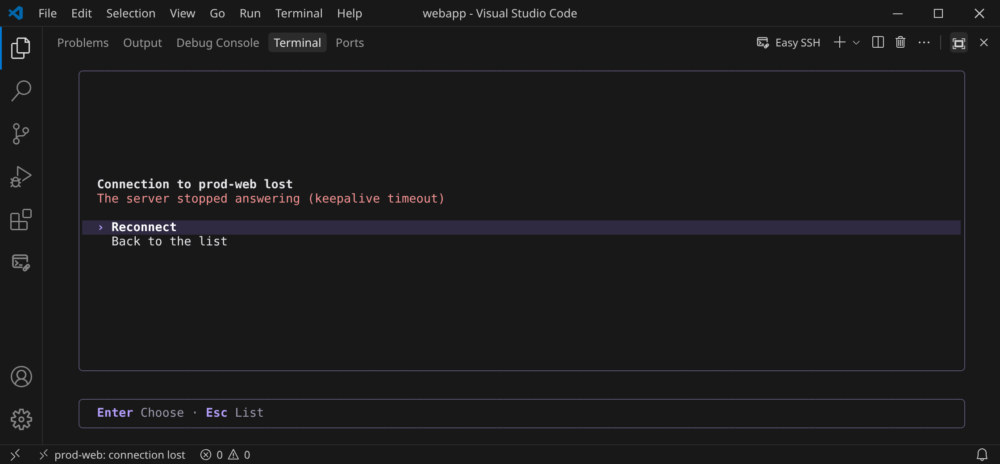

### Keyboard and mouse

| Action | Result |
| --- | --- |
| Type, arrows, Tab, Ctrl+R, Ctrl+L | The remote shell handles the keys. Tab finishes a path such as `cd /tm` |
| Ctrl+click a file name (Cmd+click on macOS) | Action menu: Download, Open (text files), Rename, Delete |
| Ctrl+S (Cmd+S) in an opened file | Save it back to the server |
| Ctrl+click a folder name (Cmd+click on macOS) | Action menu: Download (with everything in it), Upload, Rename, Delete |
| Enter in the action menu | Download |
| Drag with the mouse | Select text |
| Drag files or folders onto the terminal | Upload into the current remote folder |
| Ctrl+C | Stop the running remote command. It never cancels a transfer |
| Ctrl+Z | Suspend the running command (`fg` continues it) |
| **Easy SSH: Cancel Transfer**, or Cancel in the notification | Stop the running transfer |
| Paste | Keep line breaks, including a heredoc |
| `exit` | Disconnect and go back to the connection list |

If `editor.multiCursorModifier` is set to `ctrlCmd`, names open with Alt+click instead, like other VS Code terminal links. With **Easy SSH: Plain Click** (`easySsh.plainClick`) a plain click opens the action menu, and selecting text needs Shift+drag. On macOS, turn on `terminal.integrated.macOptionClickForcesSelection` and use Option+drag.

## Downloads

Downloads go to your **Downloads** folder: the one your system actually uses, including a localized or redirected folder on Windows and Linux. If there's none, they go to the Desktop. Type `/folder` on the connection panel, or run **Easy SSH: Set Download Folder**, to choose another folder. The folder in use is named in one of the connection panel's tips and in **Output → Easy SSH**.

## Jump hosts and `~/.ssh/config`

Use a hostname, an IP address, or one or more jump hosts when the server is only reachable through a bastion. Jump hosts entered in the terminal sign in the same way as the connection. A saved password is tried once on each password hop, and Easy SSH asks when it doesn't work.

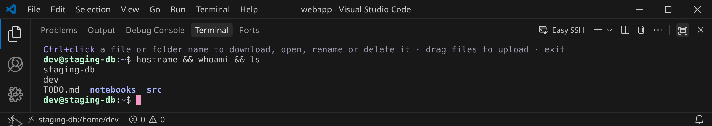

*A session on `staging-db`, reached through `bastion.example.com`.*

`/import` reads `~/.ssh/config`, including `Include` files under `~/.ssh`. It keeps each host's user, port, identity file and `ProxyJump` chain, and applies `Host *` and wildcard defaults the way `ssh` does: the first value wins. Hosts that need a `ProxyCommand` are listed and skipped. Importing again updates hosts without losing your manual edits or start folder.

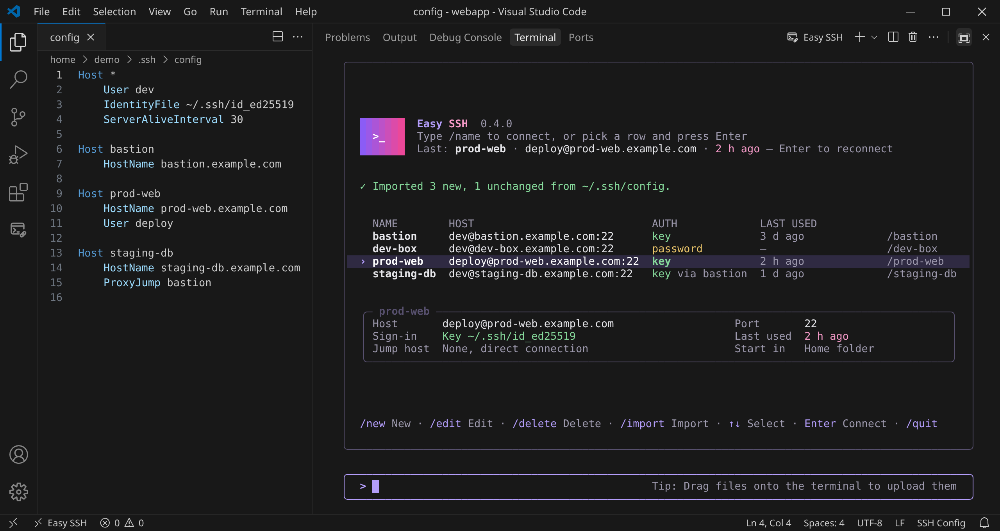

*`/import` reads the hosts from `~/.ssh/config`.*

With SSH agent sign-in, Easy SSH tries the agent first, then `~/.ssh/id_ed25519`, `id_ecdsa` and `id_rsa`, like `ssh`. On Windows it uses the OpenSSH Authentication Agent service, or Pageant (`easySsh.windowsAgent`).

## Security

- **Host keys.** The first time you connect to a server, Easy SSH shows its key fingerprint and connects only if you accept it. Keys listed in `~/.ssh/known_hosts` are trusted without asking, and `@revoked` keys are refused. If a key changes, Easy SSH shows the old and the new fingerprint and asks again. Behind jump hosts, each hop is checked separately. `known_hosts` is only read, unless you turn on `easySsh.knownHostsWriteBack`.

  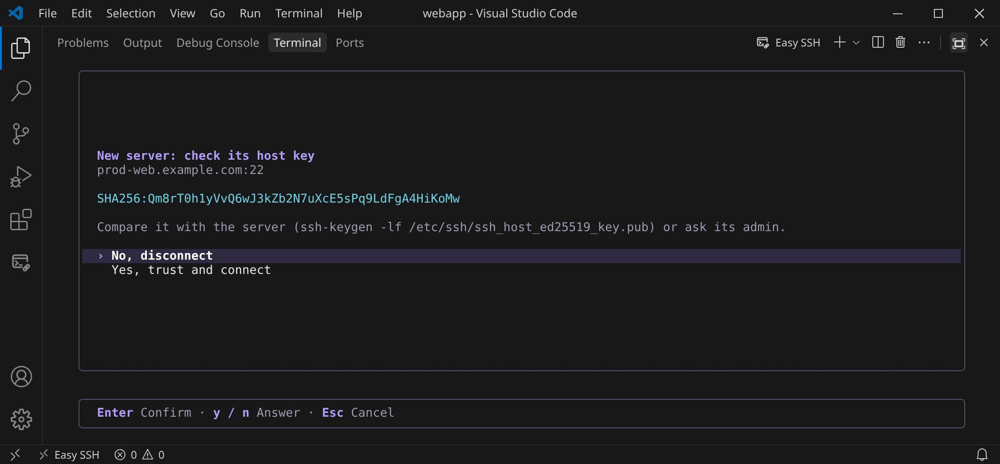

- **Forget Trusted Host Keys…** lets you pick hosts, or all of them, and asks before it forgets anything.
- **Passwords and key passphrases** are kept in the editor's secret storage. That's the OS keychain: Windows Credential Manager, macOS Keychain, or the Secret Service / libsecret keyring on Linux. On Linux without a keyring, VS Code may fall back to weaker storage; choose **ask every time** for those connections. Private keys stay in the files you point at.
- **The saved password is only sent where it belongs:** to the password prompt, once. Two-factor and other keyboard-interactive prompts are always shown to you.
- **Connection details** (host, user, port, key path, jump hosts) and trusted fingerprints are stored in the editor's extension storage. They're not secrets, but they're not synced either.
- **Defaults stay strict.** Easy SSH uses ssh2's modern algorithms. It doesn't enable legacy ones such as `ssh-rsa` with SHA-1 or `diffie-hellman-group1`, and it has no agent forwarding.
- **Transfers** keep permission bits: a downloaded `0600` file stays `0600`.

## Settings

| Setting | Default | What it does |
| --- | --- | --- |
| `easySsh.downloadFolder` | *(Downloads)* | Where downloads go |
| `easySsh.plainClick` | `false` | Open the action menu with a plain click instead of Ctrl/Cmd+click |
| `easySsh.hostKeyPolicy` | `ask` | `ask` shows a new server's fingerprint; `trustFirst` trusts it on first connect |
| `easySsh.knownHostsWriteBack` | `false` | Also add accepted keys to `~/.ssh/known_hosts` |
| `easySsh.transferConcurrency` | `32` | SFTP requests in flight per file (1–64) |
| `easySsh.maxTransferFiles` | `5000` | Most files per upload or folder download |
| `easySsh.keepaliveInterval` | `15000` | Milliseconds between keepalives; `0` turns them off |
| `easySsh.keepaliveCountMax` | `3` | Unanswered keepalives before the connection counts as lost |
| `easySsh.autoReconnect` | `false` | Reconnect by itself after a drop (2, 5, 10 s) |
| `easySsh.maximizePanel` | `true` | Maximize the panel while Easy SSH is open |
| `easySsh.terminalLocation` | `panel` | Open Easy SSH in the panel or as an editor tab |
| `easySsh.windowsAgent` | `auto` | Windows agent: `auto`, `openssh` or `pageant` |
| `easySsh.readyTimeout` | `20000` | Handshake timeout in ms; time spent on prompts doesn't count |
| `easySsh.colorDepth` | `truecolor` | Colors the Easy SSH screens use: `truecolor`, `256` or `16` |
| `easySsh.themeSession` | `true` | Also give connected shells in Easy SSH terminals the Easy SSH cursor and ANSI colors |

## How it compares

| | Easy SSH | Remote-SSH | SSH FS | `ssh` in a terminal |
| --- | --- | --- | --- | --- |
| Installs on the server | Nothing | VS Code Server | Nothing | Nothing |
| Works on old, small or locked-down servers | Yes | Often not | Yes | Yes |
| Works in Cursor and VSCodium | Yes | Microsoft builds only | Yes | Yes |
| Saved hosts and jump hosts | Yes | Through `~/.ssh/config` | Yes | Through `~/.ssh/config` |
| Ctrl+click a name to download, open, rename or delete | Files and folders | No | No | No |
| Upload by dropping onto the terminal | Yes | Into the explorer | Into the explorer | No |
| Edit remote files in the editor | One file at a time, from the shell | Yes | Yes | No |
| Remote language servers, debugging | No | Yes | No | No |

Use Remote-SSH when you want to develop *on* the server. Use Easy SSH when you want a quick, reliable shell with easy file transfer, especially on servers you can't or don't want to install anything on.

## FAQ

**Does it work with two-factor authentication?** Yes. Keyboard-interactive prompts (OTP codes, Duo, PAM questions) are shown in the terminal. The saved password only answers the password prompt.

**My host uses `ProxyCommand`.** Easy SSH can't run proxy commands. If it's an `ssh -W` hop, use `ProxyJump` instead. `/import` lists the hosts it skipped.

**Where did my download go?** To your Downloads folder, unless you chose another one with `/folder`. The status bar and **Output → Easy SSH** show the full path.

**How do I download a folder?** Ctrl+click its name (Cmd+click on macOS) and choose **Download**. It downloads with all its files and subfolders.

**How do I delete or rename a remote file?** Ctrl+click its name and choose **Rename…** or **Delete…**. Both ask before they change anything.

**How do I edit a remote file?** Ctrl+click its name and choose **Open**, then save with Ctrl+S (Cmd+S). Open is only offered for text files; for anything else, download it.

**Why is there no Open for this file?** Easy SSH thinks it isn't text: its name says so (an archive, image, program…), or its first 8 KB contain NUL bytes or invalid UTF-8. Download it instead.

**How do I change directory?** Type `cd`, as in any shell. Tab completes remote paths.

**I can't select text with the mouse.** Easy SSH doesn't turn on mouse reporting, so a normal drag selects text. Some full-screen programs (`vim` with `mouse=a`, `tmux` with mouse on, `htop`, `mc`) do. While they run, or with `easySsh.plainClick` on, hold Shift and drag (on macOS: Option+drag with `terminal.integrated.macOptionClickForcesSelection`).

**An upload after `sudo su` asks where to put the file.** Uploads go over SFTP as the user you signed in as, not as `root`. If Easy SSH can't tell which folder the switched shell is in, it asks: upload to the last known folder, your home folder, or a folder you type. To put a file where only root can write, upload it to your home folder, then `sudo mv` it. Easy SSH shows that command after the upload.

**Upload fails with "Permission denied".** The server refused the write for the signed-in user. The message names the path. Check it with `ls -ld <folder>`.

**The connection drops when idle.** Lower `easySsh.keepaliveInterval`, for example to `10000`. Turn on `easySsh.autoReconnect` to reconnect by itself.

**Sign-in fails with the agent.** Make sure an agent is running and holds your key (`ssh-add -l`). On Windows, start the "OpenSSH Authentication Agent" service or Pageant. The error message says what Easy SSH tried.

## Develop

```bash
npm install
npm run check     # typecheck
npm run lint
npm test          # unit tests
npm run compile
```

To run the integration tests, start the test server from `test/integration/Dockerfile` (the file explains how), then set `EASYSSH_IT_PORT` and `EASYSSH_IT_KEY` and run `npm run test:integration`. Press F5 in VS Code or Cursor to run the extension. Both editors use the same extension API, so there is no separate Cursor build.

Questions and ideas: [GitHub Discussions](https://github.com/dhlptx00/EasySSH/discussions). Bugs: [issues](https://github.com/dhlptx00/EasySSH/issues).

## Rate it

If Easy SSH helps you, a rating on the [VS Code Marketplace](https://marketplace.visualstudio.com/items?itemName=easy-ssh.easy-ssh&ssr=false#review-details) or [Open VSX](https://open-vsx.org/extension/easy-ssh/easy-ssh/reviews) helps others find it.

## Support

If Easy SSH saves you time, you can support its development:

[](https://buymeacoffee.com/dhlptx00)
